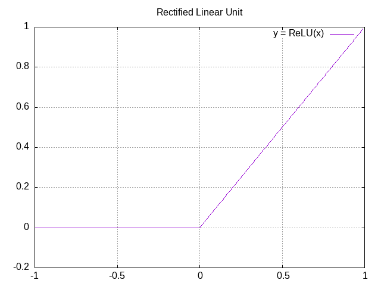
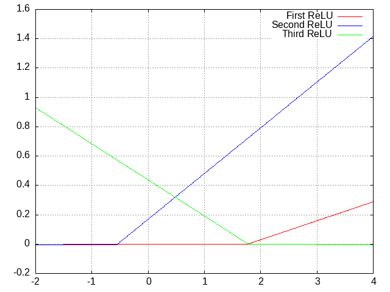
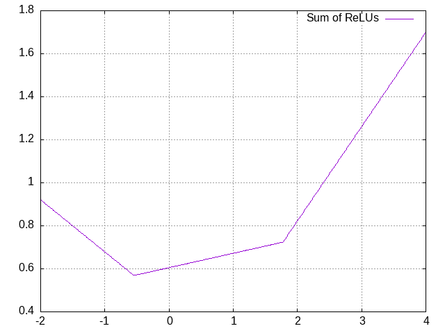
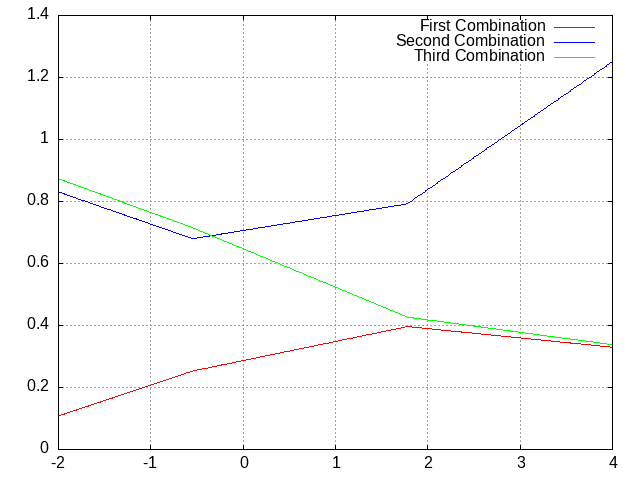
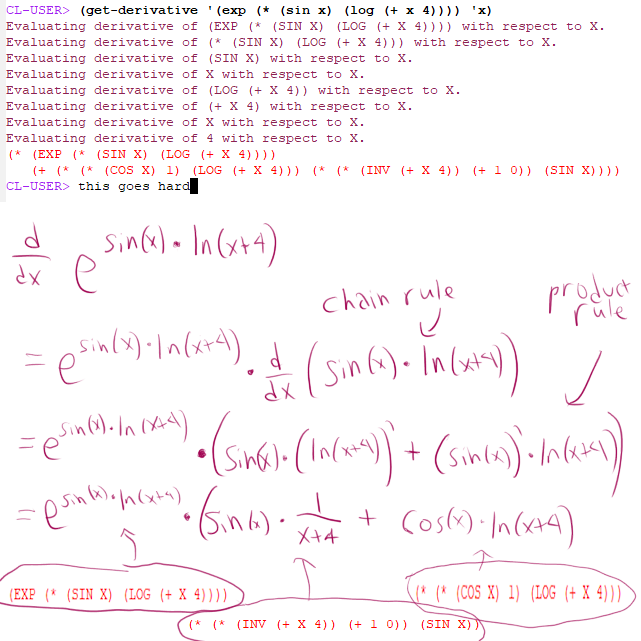
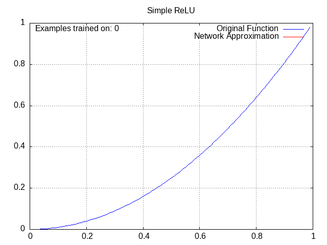
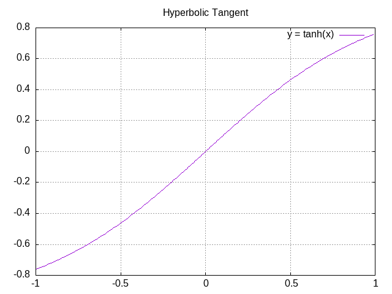
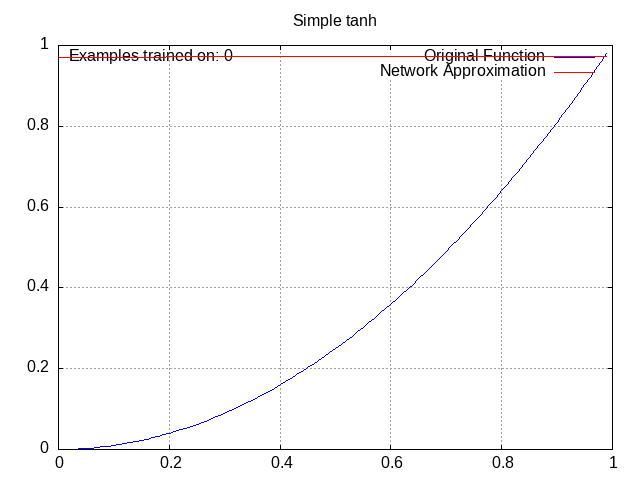
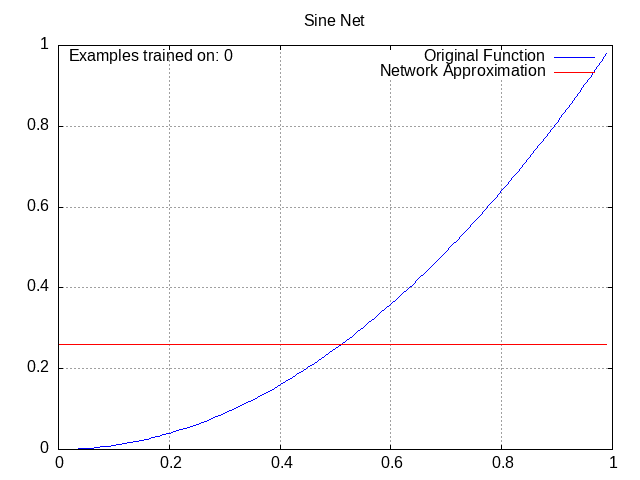
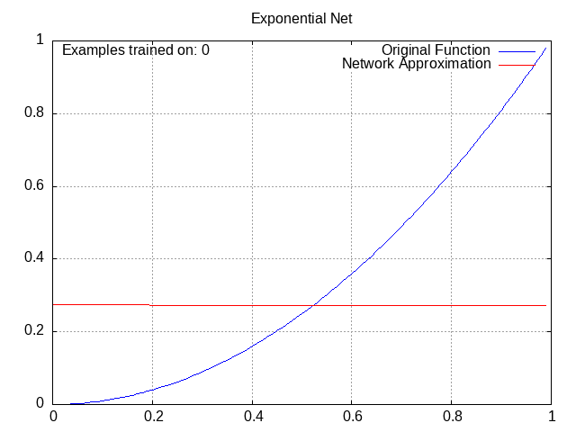

## Project Details

When I was looking at the math for how neural networks worked, I got a little skeptical about the math used in them. Since the learning process used nothing but basic calculus principles, in theory there was nothing stopping me from using any function I wanted-- and in practice, it could maybe even be more efficient in some situations.

The finished code is essentially a general-purpose framework that I could use to put in any math function and get a neural network that uses it. I tested the resulting networks on simple patterns as a proof-of-concept that they can work.

You can find the repository [here](https://github.com/erin-online/lisp-neural). This code is definitely better than last time but still isn't very suited for use by other people. If you want me to make it more accessible, just message me on [Twitter](https://twitter.com/cityposting) or on Discord at cityposting.

## What does it mean for a neural network to use a math function?

Basically, neural networks are functions with a lot of variables that try to match a pattern as closely as possible. The specific pattern in question can be anything. How do they do this? Let's look at an example, the ReLU (Rectified Linear Unit) function:

So let's say that we have a mysterious function, and we're trying to fit it as best we can. What we can do is first add in two parameters: a simple multiplier ("weight") and a simple vertical movement ("bias"). Then, we can add together several ReLUs, each with their own weight and bias, to produce an arbitrary pattern:

 

The more ReLUs we add together ("nodes"), the more complex a pattern we can make. Additionally, we can feed the resulting pattern into another set of ReLUs ("layer"), producing a multiplicatively higher rate of complexity:

This project basically involves using functions other than ReLU, and adding new parameters to tweak.

## You know who else likes recursion? You know who else likes recursion?

I was looking for a programming language to use for this project because I didn't want to use Python again. I decided to give Common Lisp a try because several people on the fediverse were always talking about it, and it ended up being an incredibly rewarding experience. Truly cannot recommend this language enough.

The language structure of Common Lisp lends itself particularly well to recursion, which is basically mandatory if you want to program calculus. This is because you can nest functions within each other as many times as you want; for example e^e^e^e^...^x or sin(sin(sin(...sin(x)...))). Recursion basically entails continually processing the same expression until you finally peel away all the layers, and my get-derivative function ended up working like that:

The get-derivative function was essentially the backbone of this whole project. Other people have made much better versions of this function, but I was still extremely happy with mine, especially because it's something I've been wanting to write even before this project specifically.

I won't go into too much detail about how calculus is used in this project; basically, it's used to automatically tweak the function parameters in order to make them more closely match the pattern. If you're interested in learning more, check out the [3blue1brown neural network playlist](https://www.youtube.com/playlist?list=PLZHQObOWTQDNU6R1_67000Dx_ZCJB-3pi), which is what I learned from.

## Dual Boot Gaming (or: Pain and Suffering)

It was really important that this post have some way to visualize the neural networks from the project, because words and numbers alone aren't sufficient to explain them. So I went looking for Common Lisp plotting libraries and found Lisp-Stat, which looked to be well-maintained and did work quite well for me.

The only problem was that when I tried to load it in future sessions, it just didn't work. It was some foreign library error thing. Since I'd already written some code that used the library (not a lot, in retrospect), I made what I thought was the rational choice and tried to fix the error, and was increasingly frustrated by the lack of help from both the compiler and the Internet.

You might have noticed that it's been over a year since I released my last project. Despite this, I wouldn't say that more than about three to four months of focused work went into this one. Various real-life affairs did get in the way, but I was also discouraged for months by this issue.

What I didn't want to do was learn how Common Lisp libraries were loaded, which in theory was interesting but in practice was not a trial I wanted to undertake just to finish this project. Eventually, what I did was install OpenBSD on my computer because I was wondering if the issue was with Windows specifically (also, I'd been meaning to try a different OS for a while). The library also refused to load there, which convinced me to just give up and use a different library.

This led me to vgplot, an excellent plotting library with a wonderful built-in demo that made it easy to learn. The hilarious thing about this whole affair is that vgplot worked on OpenBSD for me but not on Windows, because it couldn't find my Windows gnuplot installation (vgplot is built on gnuplot). There's likely an easy fix for this, but I didn't care to solve it because I could just do my programming in OpenBSD.

## Funny Wacky Lines

I made the following animations by writing a function that repeatedly plotted the network and saved the resulting plot as an image, then putting all the images into ezgif.

All of these have the same setup: a small network with 2 middle layers of 4 nodes each, trying to approximate the function y=x^2 from x=0 to x=1.

#### ReLU Network

Activation = relu(w1a1 + w2a2 + w3a3 + ... + wnan + b), where a1, a2, a3 etc are activations from the previous layer, w1, w2, w3 etc are the weight parameters for this node, and b is the bias parameter for this node. This will be hard to understand if you haven't watched a 20-minute explanation on this stuff somewhere.

Despite being the function of choice for most neural networks nowadays, ReLU was actually inconsistent for me in practice, and would often settle in a suboptimal pattern. I chalked this up mostly to the network being small and thus likely inconsistent.

#### Tanh Network

Activation = tanh(w1a1 + w2a2 + w3a3 + ... + wnan + b).

tanh is the hyperbolic tangent function, which has also seen some use in standard neural networks, although it is overall less common than ReLU. It looks like this:

This one is still pretty standard and there isn't a lot to see here. We aren't getting into the really weird stuff yet.

#### Sine Network

Activation = wα1\*sin(wβ1a1) + wα2\*sin(wβ2a2) + wα3\*sin(wβ3a3) + ... + wαn\*sin(wβnan) + b, where alpha and beta are used to distinguish the weights from each other. This looks more confusing than it is. Note that unlike the ReLU and tanh networks, this one has no overall "wrapping" function, instead opting to modify each previous activation individually.

If you're wondering why these plots all go from x=0 to 1, you can thank the sine network for that, because higher x values literally don't work for it (you start getting the same output for low and high x values, in theory it's workable with low wβ values but in practice the gradients don't go out of their way to favor those). Outside of that, though, it actually worked pretty well.

#### Exponential Network

Activation = c \* e^(w1a1 + w2a2 + w3a3 + ... + wnan), where c is the coefficient (like the bias except you multiply it instead of adding it)

This is one of my favorites; I love watching the exponential curves work together to produce a perfect fit. Granted, the x^2 pattern definitely favors this one.

Originally I wanted to add more weird networks here, but I wasn't really inspired. Maybe I'll just edit this post down the line.

## Thoughts and Takeaways

Lots of stuff to put here:

* Don't get owned by sunk cost fallacy. Throw away things if it'll make the project move along faster.
* Neural networks need to be very fast to do cool stuff. My code was not at all speed-optimized, so I wasn't able to train it on more complex things like the MNIST handwriting database, and even the above animations took a couple minutes each to generate.
* There's probably no need to deviate from the standard ReLU functions for practical purposes. I would maybe be able to give a better answer if I had more of a math background, but I don't.
* For that matter, learning the relevant math (or other subjects) for a project is pretty important. When all you know is how to program stuff, it's easy to get caught up in a vortex without knowing where you are or what you're doing. More theoretical knowledge goes a long way here.

## Plans

* Smaller-scale projects, more writing, more reading.
* Common Lisp is really cool. In the future I'll probably use existing CL machine learning libraries like clml, which (presumably) are faster.
* I'll probably move this site to a different domain within a year or two. The old domain will redirect to the new one.
* I might learn HTML/CSS at some point to make this website prettier; I've seen some great-looking indie sites out there recently. This would probably go along with the previous step.
* I happened upon [this article](https://arxiv.org/pdf/2304.06035.pdf) recently which is pretty relevant to the stuff I've been doing, so I might draw some inspiration from it for future projects.
* The next projects will probably involve ideas from [A Thousand Brains and the Minecraft Problem](../../writings/atb_and_the_minecraft_problem).