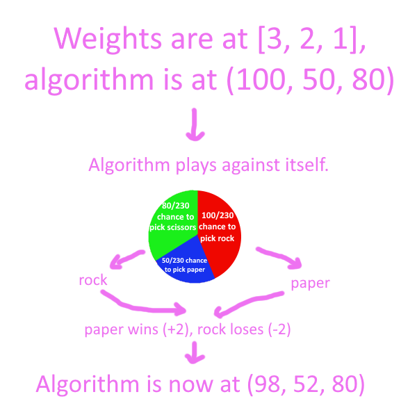

## Project Details

In this project, I created an algorithm to play weighted [rock-paper-scissors](https://en.wikipedia.org/wiki/Rock_paper_scissors). "Weighted" here means that depending on which choice you win with, you get different rewards. For example with weights [3, 2, 1], you get 3 points for winning with rock, 2 points for winning with paper, and 1 point for winning with scissors.

I wanted the algorithm to converge toward **optimal** (least exploitable) play. In unweighted rock-paper-scissors, this looks like a 1/3 chance to play each choice. When you add in weights, it looks like the following:

The easiest way to do this is to have the algorithm play itself 3 times to determine the weights, then set itself to the optimal strategy instantly. I thought this was a little cheap and wouldn't make me learn much, so I looked at what else I could come up with.

I didn't want to use a neural network for this because it looked like an overcomplicated solution to a simple problem. I wanted to work with something I could understand.

## Initial Algorithm

The algorithm I worked with was extremely simple, and worked similarly to the [MENACE](https://en.wikipedia.org/wiki/Matchbox_Educable_Noughts_and_Crosses_Engine). It stored three values, one for each choice, and increased or decreased them whenever it played against itself.

The bulk of my tests consisted of starting all the algorithm's values as equal, such as (100, 100, 100), then giving it an asymmetrical weight set such as [2, 1, 1] and seeing if it could find its way to the optimal strategy.

I expected this to be fairly straightforward, but ran into confounding results. Rather than converge, each value continued to oscillate similar to a sine wave. Additionally, over time the oscillations became broader.

This eventually led to *extinction*, which is where one option hits 0 and so is never played again, leaving the option it beats to dominate.

## Smooth RPS

In order to figure out what was going on here, I decided to analyze the sine-like function that the algorithm was producing and see if I could figure out its equation. This was a terrible idea, but it sounded good at the time.

Anyway, the first thing I needed to do was get rid of the randomness involved in option selection, so I came up with Smooth RPS. Basically, rather than simulating an actual game of rock-paper-scissors, Smooth RPS predicts how much the algorithm will change, on average, and makes that change. Here's an example:

This also helpfully eliminated extinction, because the lower a choice's value got, the less likely it was to be played, meaning the value didn't decrease by as much.

## Mathematical Function Hell

Here was the function Smooth RPS gave me for each choice:

This is a little bit different from a sine wave:

By scouring Wikipedia, I found the [Clausen function](https://en.wikipedia.org/wiki/Clausen_function), which is a really cool function involving summation of sines. There are a lot of ways to mess with it, and I spent several hours on it but was ultimately unable to have it line up with the line my algorithm produced.

At this point, I was feeling pretty discouraged. My adventure through weird math stuff was fun, but I had no idea how to actually make progress in the project. But it wasn't over yet.

## Spiral

My next idea was representing the data on a [barycentric graph](https://en.wikipedia.org/wiki/Barycentric_coordinate_system). Up until this point, I'd been convinced that I couldn't model all three variables at once without using a 3D graph. Putting them on a triangle changed that.

When I modeled the adaptation of the algorithm on it, I was face-to-face with the spiral for the first time:

(Note: The white square in the middle is the optimal strategy.)

Suddenly everything became clear.

The algorithm trended towards a circular pattern because it was trying to win against itself more. Optimal strategies are of little use when they can never give you any advantage. If your friend is always playing rock against you, then you should start playing paper more frequently, even though that loses to someone who plays scissors.

Why, then, did it spiral out of control? This was due to Smooth RPS not being smooth enough. By changing the algorithm a bit at a time through iterations, it essentially tried to simulate a circle using straight lines, which resulted in it growing larger over time:

The solution was also clear. The spiral was constantly moving *away* from the optimal strategy, but I could simply re-engineer it to turn it *inward* instead.

What I did for this was take every algorithm change, convert it into barycentric coordinates, rotate it counterclockwise by 90 degrees, then convert it back into value changes.

This worked exceedingly well. You can see the algorithm instantly seeking out the optimal strategy.

## Thoughts and Takeaways

I'm really happy with how this project turned out. The solution was very elegant and gave me some neat things to take away.

* The concept of "breaking down" games is interesting. Fighting games for example are often considered as rock-paper-scissors + frame data and stuff, so if you have all the frame data figured out, then you can simplify the game down to rock-paper-scissors which we have here.
* Ways to visualize many variables at once can be really useful, although barycentric only works for 3 variables in 2D space.
* Machine learning algorithms should have some model of *themselves*. This was implemented in the solution here when the coordinates are converted.

## Plans

* I'll probably keep hosting this site on GitHub for now. I plan to mostly directly link it through various online avenues and don't want to go through the time and money of setting up a domain right now.
* Obviously I'll work on a more complicated game than rock-paper-scissors next time. I was thinking of doing something with chess, because it fits a few criteria quite nicely. It's simple and easy to simulate, it has a lot of depth, and I have a personal interest in making sure the current best chess engine, Stockfish, perishes in spectacular fashion for telling me all my awesome and funny moves are "inaccurate" and "blunders".
* I don't want to use Python anymore. I know it's often used for machine learning, but it just does not work for me. My code by the end was an absolute mess and debugging took a couple hours. I know this is partly me just being a bad programmer, but when I've used languages like Java in the past I feel like they do a better job forcing me to get some groundwork in place. I'll go language shopping which will probably slow me down a bit, but this is fine, I'm in no rush.
* On that note, I've been meaning to try operating systems besides Windows. I've been on Windows machines for my whole life simply because it's the status quo and there's nothing new for me to wrap my head around. I think it's time for me to actually make an effort to improve my experience using my computer. (Recommendations are welcome.)
