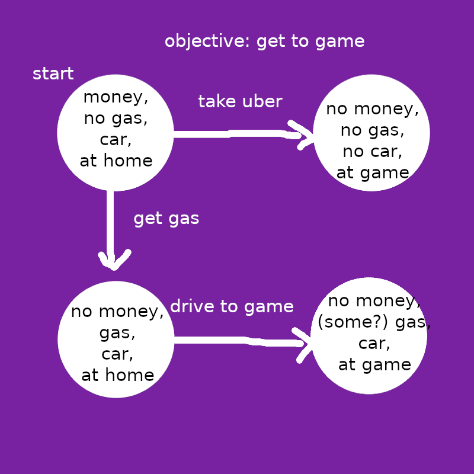

## Status Report
I was hoping to speed up my rate of completion on projects, but this has proven to be a harder task than it looks. In this case, the actual programming process is only a small part of it--the real difficulty lies in logically defining the problem, so that I can actually start on the programming. This post will show off the progress I've made so far on that front.

## Deduction and Induction
In *The Myth of Artificial Intelligence: Why Computers Can't Think The Way We Do*, Erik Larson points to problems with deductive and inductive reasoning to show the limits of current AI systems:

### Deductive Reasoning
* A causes B. A has happened, therefore B will happen.
* Example: Rain falling causes the streets to become wet. It is raining, so the streets will be wet.

Peter Norvig's *Paradigms in Artificial Intelligence Programming* provides an illustrative example of deductive reasoning applied to AI: Newell and Simon's General Problem Solver, developed in 1957. The General Problem Solver (GPS) essentially uses deduction via tree-search methods to navigate from one world-state to another, as the following diagram illustrates:

Using a pre-defined graph like this, the GPS can look ahead to find paths that satisfy the given objective. The algorithms it uses to do so were around well before the GPS's conception, but it was the first system to use them in a more general context. (Interestingly, this runs parallel to the generalization of [grid cells and place cells]() in human neuroscience.)

The General Problem Solver was initially thought to be the last innovation AI ever needed, but it quickly became clear that the system was not nearly as powerful as initially expected. Like most other examples of old AI, GPS now has a reputation of being rigidly dependent on people feeding in laborious manually-curated data, only to provide an answer that said people could likely already find on their own. The system cannot handle uncertainty (every variable must be known beforehand), and it doesn't scale well--both of which are death sentences for the majority of real-world applications.

### Inductive Reasoning
* B often follows A, so A likely causes B.
* Example: When it rains, the streets typically become wet, so raining may cause the streets to become wet.

Induction was one of the main driving forces behind the thawing of the second "AI winter" in the 1990s (alongside increasing computing power). Neural networks, which used inductive reasoning, got over many of the hurdles that tripped up purely deductive systems. Problems that were extremely difficult to explicitly describe could instead be implicitly described. For instance, handwriting recognition, a daunting task for deductive processes, is trivial for neural networks, requiring nothing more than a decent supply of labeled data. ("I can't describe what a 5 looks like, but this, this, and this are all 5s.")

If deduction can be compared to tree search, a good metaphor for induction is data compression. Using nothing but numeric parameters, a neural network can efficiently store information about any pattern, in many instances without human input. Additionally, the network can extrapolate, generating its own content that follows the same patterns. This is impressive! Inductive systems' increased capabilities have earned them deserved cultural relevance and placed them at the center of a swelling AI boom.

That said, induction and deduction can only get us so far. One issue with inductive systems is that they struggles to handle dynamic systems; their rigid storage of patterns can render them unable to adapt to changes. For example, a neural network trained on a video game with many levels will likely "feel its way through" every level individually, rather than learn and use the game's basic mechanics. (See [this video](https://youtube.com/watch?v=DmQ4Dqxs0HI) for an example.) Even worse is real life, which is "constantly changing in both predictable and unpredictable ways, and we can't enclose it in a system of rules". (Larson 125) Induction's implicit pattern-recognition applied to such situations feels like trying to cover a sphere's surface with rigid sheets of metal--any insight gained is fleeting, and adding more just makes you look stupid.

## Abduction
* A causes B. B has happened, so this may be due to A.
* Example: Rain falling causes the streets to become wet. The streets are wet. Therefore, it might be raining.

Formalized by philosopher Charles Peirce in the early 20th century, abduction is distinct from both deduction and induction. Wikipedia calls it a way to *orient us in our surroundings*, something a struggling neural network in a dynamic system would certainly appreciate. Abductive reasoning isn't exactly logically sound; essentially, it's nothing more than a guess. The important thing it brings to the table is in telling us where to look for relevant information. To continue our example, if we want to know why the streets are wet, we can infer that it might be raining. Then, if our inference is false, we can search for alternative explanations, like a fire hydrant going off.

Some common applications of abductive reasoning include murder mysteries (examining evidence to determine which circumstances might have been responsible) and games such as Twenty Questions (guessing candidates given a set of characteristics). Note that [Akinator](https://en.akinator.com/) and similar systems skip the abductive step and go all-in on deduction, since their relatively small databases and pre-defined questions can be worked with quickly. 

Additionally, Peirce contends that abduction is used in even basic tasks like human visual recognition. Looking at an unfamiliar book, we can abduce that it is in fact a book (despite never having seen it before). Why is it here? Someone must have left it on the table. What's it about? You can probably guess from looking at the cover. Is it worth reading? You've probably already decided.

Abduction can be used in any scenario, but according to Larson and Peirce, it is best applied as a reaction to a surprising fact. If we notice that our friend is in an unusual mood, we're inclined to seek out potential explanations if we aren't in a position to just ask them. If our stomach hurts, we look for potential causes (things we ate, people we came into contact with). Memories of events that seemed benign at the time are combed through with renewed vigor: maybe that expired milk wasn't fine after all.

## Okay awesome Erin so what's the programming project
Please leave me alone

People have known about abduction in AI since the 90s, but no one (that I'm aware of) has made anything worthwhile with it yet, so there are probably some good reasons as to why it doesn't see commonplace use. For the next step in this project, I'll look into other people's efforts to integrate abductive reasoning into AI systems. These should offer a pretty sound starting point for the actual programming part and ensure I don't waste as much time on inherently faulty ideas.

My approach will likely use all three of deduction, induction, and abduction, because abduction isn't particularly useful without the other two reasoning types to supplement it. The most straightforward way to do this is by somehow integrating abductive reasoning into a neural network, but I haven't given any thought as to how to do this, and at any rate I need to do more research on the various ways by which neural networks can be extended (such as convolutions, adversarial networks, and temporal programming).

Initially I was going to add a section in this post in which I hypothesized about thoughts in philosophy and religion ("why am I here?") arising from abductive reasoning asking why things in the world are the way they are, and if artificially programmed abduction might independently produce those same thoughts. However, without any actual programming in place this can't really be much more than a fun thought experiment.

This post had much less substance than I thought it would. I have a lot of work to do. I'll see you all in a few months or years or whatever.
