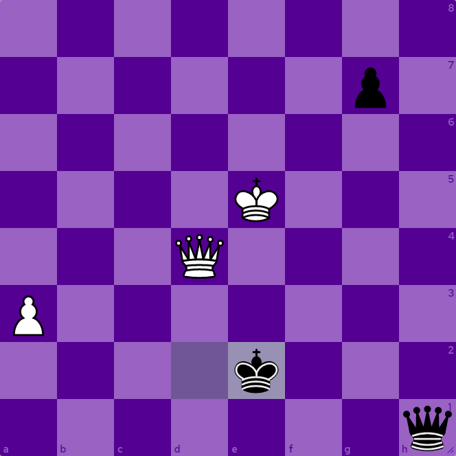
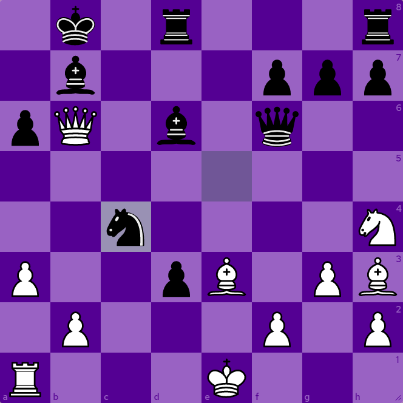
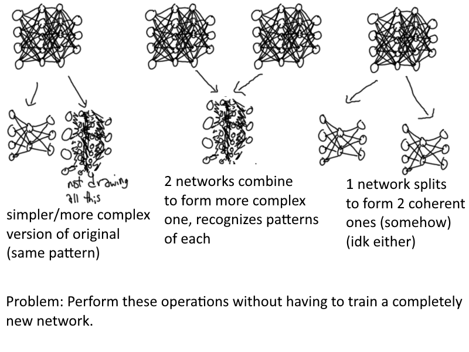

## Mini Progress Update

Before I get into the post for today, I want to share how things have been going since the conclusion of my first project:

* I've been working with Common Lisp and it's been good to me so far. When I said I wanted a language that encouraged me to get groundwork in place, my only frame of reference was object-oriented stuff like Java. I still think OOP is neat, but Lisp's interactive REPL is great as well to help me work through bugs. The syntax is also really easy to understand. My code is actually readable this time so I'll be linking the GitHub repository in the project writeup.
* I'm implementing a basic neural network which is almost done. (This is not the main part of the project, which will come later.) Motivation has dried up a bit recently, I have to take care of myself better. No major obstacles other than getting this version of Emacs to stop autocompleting my parentheses and maybe implementing some basic graphics so I can see what's going on, like the graphs in the last project.
* A couple friends recommended Arch Linux to me so I installed that, but it's just been a barrage of googling error message after error message to move forward so far. (Currently I have it installed, but need to install a network package so I can connect to the Internet and install other packages.) I'm gonna stay on Windows for now and will maybe press onward in the future, idk.

## Problems with the Chess Community

Most people I know are familiar with the disdain I have for my local chess scene. The reason for this is that most of the people in it feel uninterested in using chess to make friends or get to know people better. It ends up in an intensely casual game with no passion involved, so the unique playstyle and vision of the game both players have ultimately receives no attention. This isolation is especially hurtful in my case; as a trans woman I almost never get gendered correctly at the chess club. This is in stark contrast to other competitive communities I notice.

This lack of interest in using chess to understand things seems to extend into the world of computer chess. Engines such as Stockfish, Leela Chess Zero (Lc0), and Komodo are unimaginably strong compared to even the best humans. It seems completely ridiculous that no new understandings can be drawn from this mastery of this incredibly complex game, but that's exactly what has happened. Two things have changed at the human level in computer chess: grandmasters have gotten better at opening preparation, and random Twitch chat spectators have suddenly become geniuses now that they can see the computer evaluation of important games in real time.

A more seasoned community member might disagree with me and provide other examples, but my point is that there is still much more to be done.

## Generalization

Consider the following game:

* There are two players, Player A and Player B.
* Player A can choose to press a red button or a green button.
* If Player A presses the red button, Player B must play through a level of Crash Bandicoot without losing a life.
* If Player A presses the green button, Player B must play through a level of Touhou without losing a life.
* If Player B succeeds, they win. If they fail, Player A wins.

Now, if we want to optimize this game using neural networks, it doesn't make a whole lot of sense to use one network for the whole thing. Don't get me wrong, generalized networks are really cool, but making one isn't as simple as telling a network to do two unrelated things. There are two main things to consider:

* The network must be reasonably powerful. (Larger number of nodes, good amount of training)
* There must be some sort of "thread" connecting the different tasks.

For a counterexample, consider the following two chess positions:

These two positions require drastically different ways of thinking in order to solve them, yet a single good neural network (or human player) can easily find the winning sequence in each. This is because of "threads" binding all of chess: The board is always 8x8, the pieces will always move the same way, the win/lose/draw conditions are the same. These threads, borders that define what is possible in the game, are the reason why strong neural networks can exist for "generalized chess", or any chess position.

## Neural Network Math Operations

This was just a fun idea I had. I don't know how useful it is in practice.

Let's say you have a network trained on recognizing a specific pattern. Given this network, can you use a specific algorithm to produce a network that recognizes the *same pattern*, with less nodes (smaller layers, less powerful)? How about more nodes?

What other operations can you do with a network? Inverting it is funny, but I'm sure that other possible operations exist.

## Know Your Enemy

Generalization is one thing, but there's more to a player than how good they are. Each person (and non-person) has their own unique fighting style based on the way they understand the game. Playing against them involves analyzing their strengths and weaknesses to come up with the best strategy. Do you push the red button, or the green button?

The concept of being "good" at a competitive game is all relative to an extent, because the trials you put your opponents through are judged from a human perspective. For example, computers react to everything much faster than humans, so in fighting games they're impervious to aggressive strategies, even though those same strategies perform well against humans. [(Example)](https://www.youtube.com/watch?v=o1bfQWy8o08) Thus, an aggressive fighting game player in a world of bots is suddenly really bad.

Different playstyles are an incredibly interesting topic, and I find it odd that they aren't brought up often when it comes to neural networks and other artificial players (besides passing observations like "wow the computer likes to play like this"). I'm interested in looking further into some questions regarding them:

* Can playstyles be represented in terms of data? Would this data look like values or like a logic system?
* If so, how can said data be made comprehensible to humans? What can neural networks do with it?
* What can be interpreted as a 'playstyle'? Images? Sentences? Entities?
* Can we do fun pseudoscience and reinvent the MBTI personality test to statistically prove that I'm the only cool player in a world of crayon-eating lame losers?

## Looking Ahead

* I will be going forward because I don't really know where else I can go.
* For Spiral I had a relatively coherent goal pretty early on, but for this project I don't feel comfortable enough in the space of neural networks to set a clear stopping point. So I'm hoping a goal will materialize as I gain more experience and try out some of my funny ideas.
* I don't set schedules cause things just kinda happen and if I feel bad about myself all of this comes crashing down. Being irresponsible is self-care, actually.