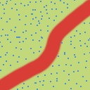
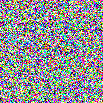
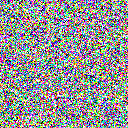

## Status Report

I hate foreign function interfaces. Forward progress will happen at some point.

## Similarity

Similarity, as it relates to art's creation, manifests as a sort of constraining or binding force, usually due to demands from people viewing the art. For an example, let's take the production of a continuously-running TV show. The following similarities may be imposed on it:
- New work must take the form of a high-quality video with a specific runtime.
- The overall style must remain consistent, though slight disruptions are tolerable.
- The internal logic of the show's universe must remain consistent.
- The audience must never be directly and acutely challenged. New work should not be unpopular.

Current generative AI output is bound by very harsh similarities, being told exactly what to create and strictly judged by AI companies and their customers to ensure that the result is as bland as possible. As a result, I actually found earlier models, such as older GPT versions and the image generators from a couple years ago, to produce more interesting things than what we have now, due to being worse at following these instructions.

## Model of an Artist

I think art can be conceived mainly in terms of difference; that is, something works better as art the more it stands out from its surroundings. The job of an artist is to create things that stand out from their surroundings. Given the fact that previously completed art pieces are themselves surroundings, this process tends towards an outward spiral of madness if unrestrained, with the artist inventing new meaning and conjuring coherence out of thin air in the name of negating all which stand before it.

Although the function "create a new piece of art, given x surroundings" is possible to implement using programming on a relatively shallow level (allowing for computer outputs like nothing, 4, and "I don't want to draw a picture, I want to go to the coffee shop" is typically outside the scope of such project ideas), simulating a model of difference which is interesting to us is much more difficult.

## Difference

These images are different from each other, but how different? We can try to use objective measures such as going pixel-by-pixel, but that very quickly runs into trouble when we consider a different type of example:

Under most human interpretations these two images are very similar, but their raw data is completely different.

No two people have the same internal concept of "difference", but more importantly, there is no perfect model of difference that everyone is trying to approximate. On one hand, we have objective measures, which work entirely differently from our pattern-seeking brains, and on the other hand we have consensus reality, which is constantly being reconstructed by the privileged groups throughout society and does not inherently need to be where it is.

## Mathematics and Other Logic Systems

This view of consensus reality is often critiqued under the reasoning that statements such as 2+2=4, which are part of consensus reality, are logically grounded and are thus unmovable. However, even rigorous logical systems aren't fundamental parts of the world.

Suppose that you have an AI system that has a calculator with only the successor function, defined as S(x) = x + 1, on it. The AI may program the calculator, adding or removing functions, in any way it pleases. The question is as follows: what non-explicitly-stated goal would this AI have to follow in order to make advances in number theory similar to those humans have made? 

For the record, this is actually a really important question; if it were possible to elegantly answer, then people could construct a machine that automatically advanced mathematics forward. However, this is entirely the wrong way of looking at it. There is no function or rule within mathematics that states that algebra is more advanced than addition, or vice versa. And because this AI exists only in the mathematical world, it thus cannot gain a model for which math is helpful and which is unnecessary.

## The Environment

Humans developed mathematics as a way of interpreting relevant things happening around them. Geometry was invented as a means of interpreting physical objects, calculus as a framework for understanding moving things, and numbers in order to count objects. While we might think of these concepts as fundamental to the very fabric of the universe, they still ultimately only exist within human consciousness. An alien society in a vastly different environment might accomplish very impressive things without any of these concepts; similarly, we might have no idea of the concepts they used, even if they were entirely comprehensible to us.

It's for this reason that I'm very interested in environment design. The artistic and mathematical spirals that may be produced by an intelligent system are really a function of their environment, so it truly remains to be seen what such systems can create with the right environment. At the very least, it might satisfy our own desire for difference. There are always questions of feasibility, though.

## Fidelity and Computation Cost

Of course, simulating a series of physical organisms in a realistic environment is prohibitively expensive on many levels. It brings to mind this passage from *Brain of the Firm* by Stafford Beer, which I think about a lot:
> Just as the best map of a country is the country itself, so the best computer of natural systems is the natural system itself. Think of the sea: it is calm. The tide turns and a great wind arises. The water is grossly disturbed. Can we imagine having to programme a computer with the relevant inputs of this situation in order to discover the precise output -- in terms of ruffled water? The task is hopeless. Yet the sea works, continuously, inexorably, it produces the answer. That answer *is* the waves and the current, the vortices, the flying spray.

The real question is as follows: can we generate interesting models of difference without entirely rendering the sea and the texture of objects and the 100 billion neurons of a human brain? Rendering an entire Earth-like environment would be tremendously impractical for the task at hand, but a very simplified version like those seen in video games isn't exactly getting us there either. Also, simulating the real world is almost definitely not the most efficient way to do this, even if we're looking to create a model of difference similar to that of humans.

The scale of possible and feasible-to-compute environments is truly massive, equal to every video game plus everything not profitable enough to be a video game. As a result, I truly cannot give any answers regarding this topic, especially before trying some things out for myself. All of that is for the next project and beyond. However, due to the incredible range of possibility stretched out here, I am optimistic about what can be done in this space.
